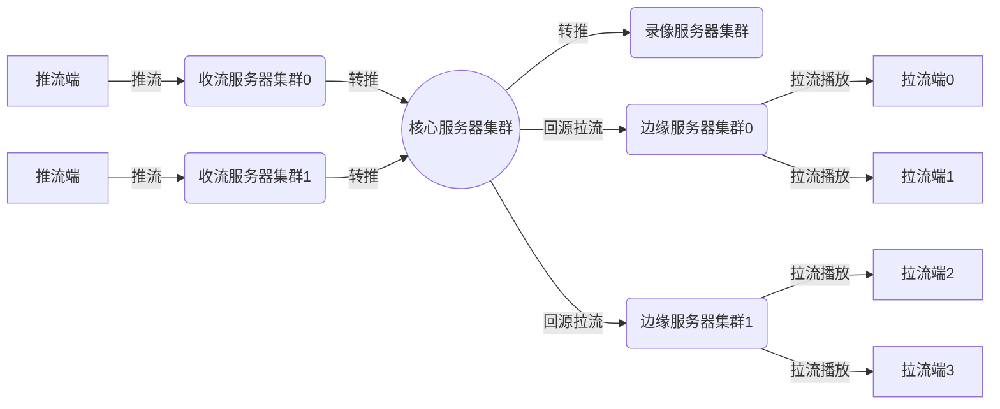

## 描述



利用`回源`和`转推`功能可以帮你快速实现上面这个结构。  
请仔细阅读[回源](./config-dir-pull)和[转推](./config-dir-push)文档。
{:.info}

### 回源类型

- 定向回源：媒体服务器通过配置文件加载源站地址，收到拉流请求(play)时向源站地址回源。
- 动态回源：媒体服务器触发[on_pull](./config-notify#on_pull)事件，通过[on_pull](./config-notify#on_pull)查询结果获取源站地址，然后向源站地址回源。

### 回源协议
- http-flv：媒体服务器支持从源站拉取http-flv流。
- rtmp：媒体服务器支持从源站拉取rtmp流。

---

## 配置

### 定向回源

注意：定向回源任务不会在worker进程启动时触发，只有在服务器接收到拉流请求（play）并且无相应流时才会被触发，换句话说如果play请求的流名已经存在，则也不会再触发pull任务。
{:.error}

#### pull

*Syntax:* `pull [url] domain=[domain] app=[app] name=[name] pargs=[pargs] referer=[referer] user_agent=[user_agent]`  
*Default:* -  
*Context:* rtmp, server, application

* **Desc**  

> - url: 可以是http-flv地址，也可以是rtmp地址，并且url只需配置到地址部分，如：`pull rtmp://live.pingos.io;` 或者 `pull http://live.pingos.io;`。
> - domain: 域名，如果配置此项参数，回源请求中将会使用这个域名替换原url中的地址部分。
> - app: 挂载点名，如果配置此项参数，回源请求中将会使用这个挂载点名拼接到url中的挂载点部分；如果不配置此项则提取触发pull任务的play请求中的application名拼接到url的挂载点部分。
> - name: 流名，如果配置此项参数，回源请求中将会使用这个流名拼接到url中的流名部分；如果不配置此项则提取触发pull任务的play请求中的流名拼接到url的流名部分。
> - pargs: 附加参数，如果配置此项参数，回源请求中将会把pargs的值拼接在url的尾部；将其作为url参数的一部分。
> - referer: 如果url是rtmp地址，则此项参数的值将会赋值给rtmp请求中的pageUrl；如果url是http-flv地址，则此项参数的值将会赋值给http请求中的Referer参数。
> - user_agent:  如果url是rtmp地址，则此项参数的值将会赋值给rtmp请求中的flashVer；如果url是http-flv地址，则此项参数的值将会赋值给http请求中的User_Agent参数。

注意：如果配置文件中缺省 domain、app、name、pargs、referer、user_agent中的一项或多项参数，服务器会从触发pull任务的play请求中提取相关参数用来初始化pull任务。换句话说如果你只配置回源IP，那么app和name都将从play的参数中获取，这样就能灵活地从源站拉取不同的直播流了。
{:.error}

* **For example**  

    ```nginx
    rtmp {
        server {
            listen 1935;
            application live {
                live on;
                # pull rtmp://122.51.177.240 domain=live.pingos.io; # 设置回源请求中的host，application（挂载点）和name（流名）从play请求中提取。
                pull rtmp://122.51.177.240 domain=live.pingos.io app=live; # 等价于 设置回源请求中的host和application（挂载点）。name（流名）从play请求中提取。
                #pull rtmp://122.51.177.240 domain=live.pingos.io app=live name=ice; # 无论你请求什么流名的流，服务器都只回源流名为ice的流。
            }
        }
    }
    ```

### 动态回源

`动态回源`{:.info}是指，通过`on_pull`事件从你的业务服务器获取回源地址的操作。  
是一种更灵活的转推方案，能够有效解决你对集群化部署的要求。  
关于`on_pull`的详细配置说明请参考[on_pull文档](./config-notify#on_pull)

#### on_pull

*Syntax:* on_pull url [args=string] [stage=[start][,update][,done]] [timeout=time] [update=time];  
*Default:* -  
*Context:* application  

* **For example**  
    ```nginx
    rtmp {
        server {
            listen 1935;
            application live {
                live on;
                on_pull http://live.pingo.io:8088/notify stage=start,update,done args=pargs;
            }
        }
    }
    ```

## 使用域名

如果你希望在`pull`或`on_pull`返回结果中使用域名，请参考[动态DNS文档](./config-dns)