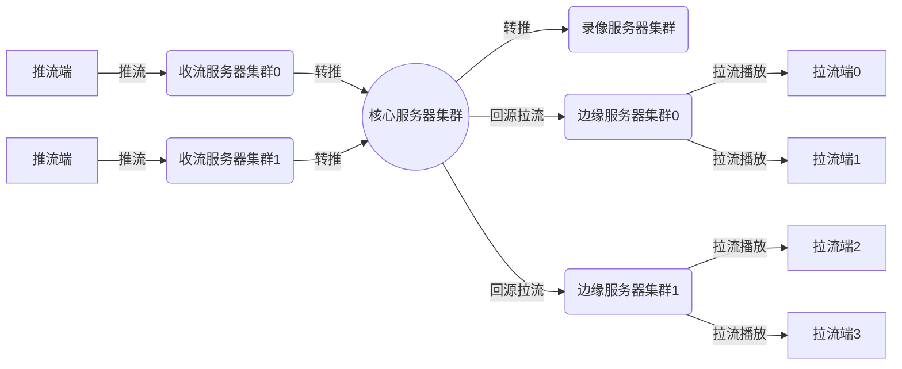

## 描述



利用`回源`和`转推`功能可以帮你快速实现上面这个结构。  
请仔细阅读[回源](./config-dir-pull)和[转推](./config-dir-push)文档。
{:.info}

### 转推类型

- 定向转推：媒体服务器通过配置文件加载源站地址，收到推流请求(publish)时向目的服务器转推。
- 动态转推：媒体服务器触发[on_push](./config-notify#on_push)事件，通过[on_push](./config-notify#on_push)查询结果获取目的服务器地址，然后向目的服务器转推。
(:.success)
^

### 转推协议

- rtmp：`push`和`on_push`配置目前仅支持rtmp协议转推，如果希望支持其他转推协议请参考[exec](./config-exec)配置。

---

## 配置

### 定向转推

注意：定向转推任务不会在worker进程启动时触发，只有在服务器接收到推流请求（publish）才会被触发。
{:.error}

#### push

*Syntax:* `push [url] domain=[domain] app=[app] name=[name] pargs=[pargs] referer=[referer] user_agent=[user_agent]`  
*Default:* -  
*Context:* rtmp, server, application  

push的设计思路和pull的非常相似，如果你已经理解了pull的配置方法那么就能很快理解push的操作。
{:.info}

* **Desc**  

> - url: 目前只支持rtmp地址。同`pull`配置一样，url参数只需配置地址，如：`push rtmp://live.pingos.io;`。
> - domain: 域名，如果配置此项参数，转推请求中将会使用这个域名替换原url中的地址部分。
> - app: 挂载点名，如果配置此项参数，转推请求中将会使用这个挂载点名拼接到url中的挂载点位置；如果不配置此项参数，则从publish请求中提取application（挂载点），然后拼接到url的application位置。
> - name: 流名，如果配置此项参数，转推请求中将会使用这个流名拼接到url中的流名部分；如果不配置此项参数，则从publish请求中提取name（流名），然后拼接到url的流名位置。
> - pargs: 附加参数，如果配置此项参数，转推请求中将会把pargs的值拼接在url的尾部，将其作为url参数的一部分。
> - referer: 此参数将会赋值给rtmp转推请求中的pageUrl。
> - user_agent:  此项参数的值将会赋值给rtmp转推请求中的flashVer。

注意：如果配置文件中缺省 domain、app、name、pargs、referer、user_agent中的一项或多项参数，服务器会从触发push任务的publish请求中提取相关参数用来初始化push任务。换句话说如果你只配置转推IP，那么app和name都将从publish的参数中获取。
{:.error}

* **For example**  

    ```nginx
    rtmp {
        server {
            listen 1935;
            application live {
                live on;
                # push rtmp://122.51.177.240 domain=live.pingos.io; # 设置转推请求中的host，application（挂载点）和name（流名）从publish请求中提取。
                push rtmp://122.51.177.240 domain=live.pingos.io app=live; # 设置转推请求中的host和application（挂载点）。name（流名）从publish请求中提取。
                #push rtmp://122.51.177.240 domain=live.pingos.io app=live name=ice; # 无论你请求什么流名的流，服务器转推出去的流名都是ice，请不要这样配置。
            }
        }
    }
    ```

### 动态转推

`动态转推`{:.info}是指，通过`on_push`事件从你的业务服务器获取转推地址的操作。  
动态转推是一种更灵活的转推方案，能够有效解决你对集群化部署的要求。  
关于`on_push`的详细配置说明请参考[on_push文档](./config-notify#on_push)

#### on_push

*Syntax:* on_push url [args=string] [stage=[start][,update][,done]] [timeout=time] [update=time];  
*Default:* -  
*Context:* application  

* **For example**  
    ```nginx
    rtmp {
        server {
            listen 1935;
            application live {
                live on;
                on_push http://live.pingo.io:8088/notify stage=start,update,done args=pargs;
            }
        }
    }
    ```

## 使用域名

如果你希望在`push`或`on_push`返回结果中使用域名，请参考[动态DNS文档](./config-dns)