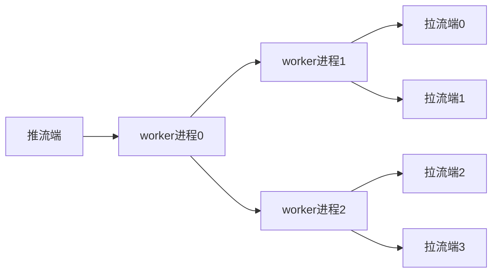

### 进程间回源



在nginx多进程情况下rtmp或http连接被分配到不同worker进程，推流端连接和拉流端连接可能会被分配到不同进程，从而导致一定概率的无法拉流。  
为了解决这个问题，我们可以让其他进程向推流端连接的进程回源。由于这种方式跟跨服务器之间的回源逻辑一致，所以我们将这种操作称为`进程间回源`{:.error}。
{:.info}

### 配置

#### rtmp_auto_pull
*Syntax:* `rtmp_auto_pull on|off`  
*Default:* `off`{:.info}  
*Context:* rtmp, server, application

* **Desc**  
进程间回源开关，on 开启进程间回源，off关闭进程间回源，如果你希望使用nginx的多进程模式，必须要将rtmp_auto_pull设置成on。  

---

#### rtmp_auto_pull_port

*Syntax:* `rtmp_auto_pull_port value`  
*Default:* -  
*Context:* rtmp, server, application

* **Desc**  
进程间回源所使用的unix套接字地址，需要注意的是此地址必须要与`multi_listen`中的保持一致。  

#### multi_listen
*Syntax:* `multi_listen [unix socket] [rtmp port]`  
*Default:* -  
*Context:* event

* **Desc**  
multi_listen的作用是让每个worker进程监听不同的unix套接字，然后通过向不同unix套接字推拉流实现多进程的流共享。

### 配置模板

    ```nginx
    user  root;
    daemon on;
    master_process on;
    worker_processes 6; # 开启6个worker进程

    error_log  logs/error.log  info;

    events {
        use epoll;
        worker_connections  1024;
        multi_listen unix:/tmp/rtmp 1935; # 为1935端口开启多进程端口映射，每个进程都开启一个unix套接字映射到1935端口上
    }

    rtmp {
        rtmp_auto_pull on;
        rtmp_auto_pull_port unix:/tmp/rtmp; # 进程间回源使用的unix套接字地址，该地址必须与 multi_listen 中的配置一致
        server {
            listen 1935;
            application live {
                live on;
            }
        }
    }

    http {
        server {
            listen 80;
            location /flv {
                flv_live 1935 app=live;
            }

            location /ts {
                ts_live 1935 app=live;
            }
        }
    }

    ```
